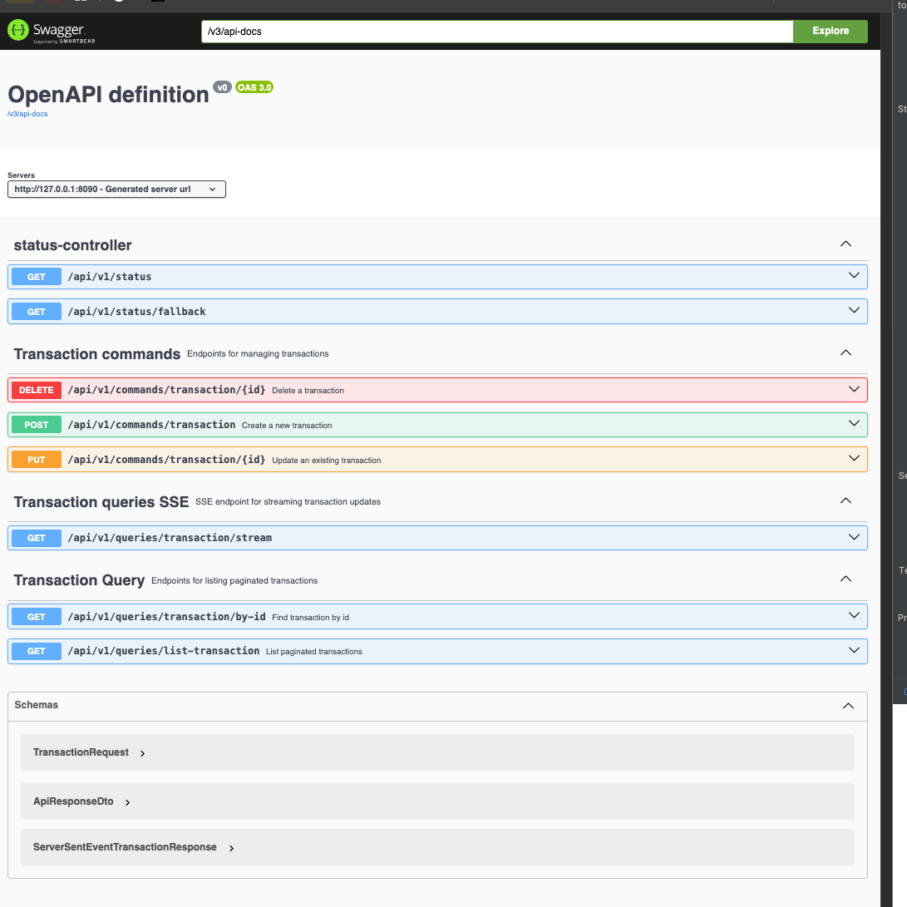

# Generated Spring CQRS +  Project

Ce projet a été généré automatiquement via le **Spring  CQRS Code Generator**. Il repose sur une architecture propre et modulaire en séparant les responsabilités via les patterns **CQRS**, **DDD** et **Event-Driven Architecture**.

## 🔧 Stack Technique

- Spring Boot WebFlux
- Spring Data R2DBC
- PostgreSQL (Reactive)
- Swagger / OpenAPI
- Java 17+

## 🌐 Architecture

```
project-root/
├── domain/
│   └── model, events, valueObjects
├── application/
│   └── usecases, commands, queries, handlers, dto
├── infrastructure/
│   └── repository, entity, config
├── presentation/
│   └── controller (REST, SSE)
```

Voir [tree.md](docs/tree.md)

## 📊 Fonctionnalités

- Génération de CRUD CQRS complets
- API REST pour les commandes
- API REST + SSE pour les queries
- Mapping DTO/Entity automatique

## ⚒️ Utilisation

Accéder à l’API REST via Swagger: `http://localhost:8090/swagger-ui.html`
 


## 📚 Domaines d'application

- Systèmes financiers en temps réel (transactions)
- ERP, CRM, outils de gestion modulaire
- Plateformes e-commerce à événements

---

Généré par **Spring CQRS Code Generator**.

Voir le Générateur : https://github.com/coundia/cqrs-webflux-generator
Voir le client SSE en angular:  https://github.com/coundia/angular-client-sse
 
